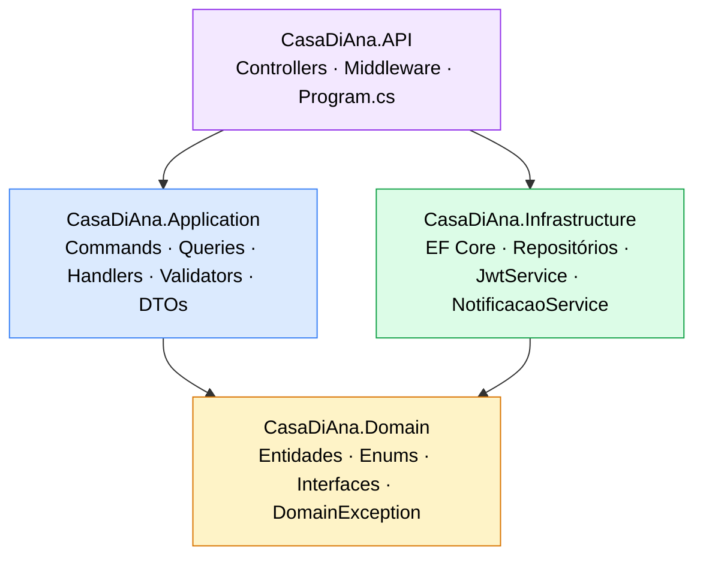

# Casa di Ana — Sistema de Gestão Operacional

Sistema ERP desenvolvido para a cafeteria **Casa di Ana**, cobrindo controle de estoque, produção, vendas, compras, inventários físicos e geração de etiquetas. O backend expõe uma API REST e o frontend é uma SPA React consumindo essa API.

---

## 🎯 Resumo Executivo

O **Casa di Ana ERP** é um sistema de gestão operacional desenvolvido sob medida para uma cafeteria artesanal. Ele resolve um problema central enfrentado por pequenos negócios do setor alimentício: a falta de visibilidade e controle sobre o que entra, o que é produzido e o que sai do estoque.

O sistema permite que a equipe registre entradas de mercadoria, produções diárias, vendas e perdas, mantendo o estoque sempre atualizado com rastreabilidade completa de cada movimentação. Alertas automáticos avisam quando ingredientes estão abaixo do mínimo. Relatórios operacionais oferecem visão consolidada da operação. Etiquetas são geradas e impressas diretamente pelo sistema, com suporte a tabela nutricional no padrão ANVISA.

O acesso é controlado por papéis de usuário, garantindo que cada colaborador enxergue e execute apenas o que lhe compete.

---

## 📌 Descrição

O sistema centraliza as operações diárias da cafeteria em um único painel:

- Controle de ingredientes com rastreamento de estoque em tempo real
- Registro de entradas de mercadoria por fornecedor (com nota fiscal)
- Inventário físico comparativo (quantidade contada vs. saldo do sistema)
- Produção diária com baixa automática de estoque via ficha técnica
- Registro de vendas e perdas por produto
- Relatórios operacionais com exportação em PDF
- Notificações automáticas de estoque crítico ou zerado
- Impressão de etiquetas para produtos e ingredientes (Completa, Simples e Nutricional)
- Gestão de usuários com controle de acesso por papel

---

## 🧠 Arquitetura do Sistema

**Resumo:** O backend segue **Clean Architecture** com **CQRS via MediatR**. Cada camada é um projeto C# separado com dependências unidirecionais — nenhuma camada interna conhece as externas.

```
┌────────────────────────────────────────┐
│              CasaDiAna.API             │  Controllers, Middleware, Program.cs
├────────────────────────────────────────┤
│         CasaDiAna.Application          │  Commands, Queries, Handlers, Validators, DTOs
├────────────────────────────────────────┤
│         CasaDiAna.Infrastructure       │  EF Core, Repositórios, JwtService
├────────────────────────────────────────┤
│           CasaDiAna.Domain             │  Entidades, Enums, Interfaces, DomainException
└────────────────────────────────────────┘
```

### Diagrama de Dependências (Mermaid)



> **Regra de ouro:** `Domain` não importa nenhuma outra camada. `Application` importa apenas `Domain`. `Infrastructure` implementa as interfaces do `Domain`. `API` orquestra tudo, mas não contém lógica de negócio.

---

### CasaDiAna.Domain
Núcleo do sistema. Não depende de nenhuma outra camada.

- **Entities/** — 19 classes de entidade com comportamento encapsulado (ex: `Ingrediente.AtualizarEstoque()`, `Produto.CalcularCustoFicha()`)
- **Enums/** — `PapelUsuario`, `TipoMovimentacao`, `StatusEntrada`, `StatusInventario`, `TipoNotificacaoEstoque`, `TipoEtiqueta`
- **Interfaces/** — Contratos de repositórios e serviços de infraestrutura
- **Exceptions/** — `DomainException` (retorna HTTP 422)

### CasaDiAna.Application
Orquestra os casos de uso. Não conhece EF Core nem detalhes de infraestrutura.

- Cada operação é um `record : IRequest<TResponse>` (Command ou Query)
- Handlers implementam `IRequestHandler<TCommand, TResponse>`
- Validators herdam de `AbstractValidator<T>` (FluentValidation)
- O `ValidationBehavior<,>` intercepta todos os requests no pipeline do MediatR e dispara validação antes do handler — erros geram HTTP 400 automaticamente
- DTOs são mapeados via `internal static ToDto()` no handler criador e reutilizados nos demais handlers do módulo

### CasaDiAna.Infrastructure
Implementa as interfaces definidas no Domain.

- **Repositórios** — Implementações EF Core de todas as interfaces de repositório
- **AppDbContext** — DbContext com 20 DbSets, schemas `auth`, `estoque` e `producao`
- **Configurations/** — Mapeamentos fluent explícitos em snake_case para todas as entidades (sem convenções automáticas)
- **JwtService** — Geração de tokens HS256
- **CurrentUserService** — Extrai `sub` e `papel` do claim do usuário autenticado
- **NotificacaoEstoqueService** — Avalia nível de estoque de cada ingrediente e cria notificações se necessário

### CasaDiAna.API
Camada de entrada HTTP.

- **Controllers** — 13 controllers REST, todos usando `IMediator` (sem lógica de negócio)
- **ExceptionHandlingMiddleware** — Intercepta exceções e converte para `ApiResponse<T>` com status HTTP adequado
- **Program.cs** — Configura serviços, aplica migrations, cria usuário admin seed e sincroniza notificações na inicialização

---

## 🧩 Estrutura do Projeto

```
ProjetoGestao/
└── CasaDiAna/
    ├── src/
    │   ├── CasaDiAna.Domain/
    │   │   ├── Entities/          ← 19 entidades de domínio
    │   │   ├── Enums/             ← 6 enumerações
    │   │   ├── Interfaces/        ← Contratos de repositório e serviço
    │   │   └── Exceptions/        ← DomainException
    │   ├── CasaDiAna.Application/
    │   │   ├── Auth/              ← Login
    │   │   ├── Categorias/        ← Categorias de ingredientes
    │   │   ├── CategoriasProduto/ ← Categorias de produtos
    │   │   ├── Ingredientes/      ← CRUD + custo
    │   │   ├── Fornecedores/      ← CRUD
    │   │   ├── Entradas/          ← Entradas de mercadoria
    │   │   ├── Inventarios/       ← Inventários físicos
    │   │   ├── Produtos/          ← CRUD + ficha técnica
    │   │   ├── ProducaoDiaria/
    │   │   ├── VendasDiarias/
    │   │   ├── Perdas/
    │   │   ├── Estoque/           ← Correção de estoque
    │   │   ├── Relatorios/        ← 5 relatórios
    │   │   ├── Notificacoes/      ← Notificações de estoque
    │   │   ├── Etiquetas/         ← Impressão de etiquetas
    │   │   ├── Usuarios/          ← Gestão de usuários
    │   │   └── Common/            ← ApiResponse, ValidationBehavior
    │   ├── CasaDiAna.Infrastructure/
    │   │   ├── Persistence/
    │   │   │   ├── AppDbContext.cs
    │   │   │   ├── Configurations/ ← IEntityTypeConfiguration<T>
    │   │   │   └── Migrations/     ← 9 migrations
    │   │   ├── Repositories/
    │   │   └── Services/          ← JwtService, CurrentUserService, NotificacaoEstoqueService
    │   └── CasaDiAna.API/
    │       ├── Controllers/
    │       ├── Middleware/
    │       └── Program.cs
    ├── tests/
    │   └── CasaDiAna.Application.Tests/   ← xUnit, Moq, FluentAssertions
    └── frontend/
        └── src/
            ├── features/
            │   ├── auth/
            │   ├── dashboard/
            │   ├── estoque/
            │   │   ├── ingredientes/
            │   │   ├── categorias/
            │   │   └── correcao/
            │   ├── fornecedores/
            │   ├── entradas/
            │   ├── inventarios/
            │   ├── producao/
            │   │   ├── produtos/
            │   │   ├── categorias-produto/
            │   │   ├── producao-diaria/
            │   │   ├── vendas-diarias/
            │   │   └── perdas/
            │   ├── relatorios/
            │   ├── notificacoes/
            │   ├── usuarios/
            │   └── etiquetas/
            ├── components/
            │   ├── layout/        ← MainLayout, Sidebar
            │   └── form/          ← FormCard, FormSection, CampoTexto, SelectCampo, etc.
            ├── lib/               ← api.ts (Axios), pdf.ts (jsPDF), etiquetasService.ts
            ├── store/             ← authStore.ts (Zustand)
            ├── types/             ← estoque.ts, producao.ts
            └── routes/            ← AppRoutes.tsx
```

---

## ⚙️ Tecnologias Utilizadas

### Backend

| Tecnologia | Versão | Uso |
|---|---|---|
| ASP.NET Core | 8.0 | Framework web |
| C# | 13 | Linguagem |
| MediatR | 12.4.1 | CQRS — dispatch de Commands/Queries |
| FluentValidation | 11.x | Validação de Commands |
| Entity Framework Core | 8.0.11 | ORM |
| Npgsql | 8.0.11 | Driver PostgreSQL |
| BCrypt.Net-Next | 4.0.3 | Hash de senhas |
| Microsoft.AspNetCore.Authentication.JwtBearer | 8.0.11 | Autenticação JWT |
| Swashbuckle.AspNetCore | 6.9.0 | Documentação Swagger/OpenAPI |
| Mapster | 7.4.0 | Mapeamento de objetos |

### Frontend

| Tecnologia | Versão | Uso |
|---|---|---|
| React | 19 | Framework UI |
| TypeScript | ~5.9 | Tipagem estática |
| Vite | 8.x | Build tool |
| Tailwind CSS | 4.x | Estilização via CSS vars |
| React Router | 7.x | Roteamento SPA |
| Zustand | 5.x | Estado global (autenticação) |
| Axios | 1.x | Cliente HTTP |
| React Hook Form | 7.x | Gerenciamento de formulários |
| Zod | 4.x | Validação de schemas no frontend |
| ECharts | 6.x | Gráficos (Dashboard e relatórios) |
| jsPDF + jspdf-autotable | 4.x / 5.x | Exportação de relatórios em PDF |

### Infraestrutura

| Tecnologia | Uso |
|---|---|
| PostgreSQL 15 | Banco de dados relacional |
| Docker (multi-stage) | Containerização de backend e frontend |
| Nginx (Alpine) | Servidor do frontend em produção |
| Render.com | Hospedagem (API + Frontend + Database) |

### Testes

| Tecnologia | Versão | Uso |
|---|---|---|
| xUnit | 2.5.3 | Framework de testes |
| Moq | 4.20.72 | Mocking de dependências |
| FluentAssertions | 6.12.2 | Assertions legíveis |

---

## 🔄 Fluxo de Funcionamento

### Backend — do request à persistência

```
Cliente (Browser)
      │
      │  HTTP Request (Bearer JWT)
      ▼
ExceptionHandlingMiddleware  ←── captura exceções, retorna ApiResponse<T>
      │
      ▼
Controller (recebe request, cria Command/Query)
      │
      │  IMediator.Send(command)
      ▼
ValidationBehavior<,>  ←── valida via FluentValidation, lança ValidationException (400)
      │
      ▼
Handler (IRequestHandler)
      │
      ├── acessa IRepository (interface do Domain)
      │         │
      │         ▼
      │   Repository (Infrastructure) → AppDbContext → PostgreSQL
      │
      ├── chama métodos de domínio na entidade
      │
      └── retorna DTO
            │
            ▼
      ApiResponse<T> { sucesso, dados, erros }
            │
            ▼
      Cliente recebe JSON
```

**Formato de resposta padrão:**
```json
{ "sucesso": true,  "dados": { ... }, "erros": [] }
{ "sucesso": false, "dados": null,    "erros": ["mensagem de erro"] }
```

**Mapeamento de exceções:**

| Exceção | HTTP |
|---|---|
| `ValidationException` | 400 |
| `DomainException` | 422 |
| `UnauthorizedAccessException` | 401 |
| `Exception` | 500 |

---

### Frontend — organização e fluxo de dados

**Resumo:** O frontend é organizado por **features** (módulos funcionais independentes). Cada feature contém suas próprias páginas, componentes e serviços, sem acoplamento horizontal. O estado de autenticação é o único estado global — todo o resto é local ao componente ou à página.

#### Organização por features

Cada diretório em `src/features/` representa um módulo funcional completo e independente:

```
features/estoque/ingredientes/
├── pages/
│   ├── IngredientesPage.tsx       ← listagem com filtros e paginação
│   └── IngredienteFormPage.tsx    ← formulário de criação/edição (React Hook Form + Zod)
├── components/
│   ├── Toast.tsx                  ← feedback visual de operações
│   ├── CampoTexto.tsx             ← input controlado reutilizável
│   ├── SelectCampo.tsx            ← select controlado reutilizável
│   └── ModalDesativar.tsx         ← confirmação de desativação
└── services/
    └── ingredientesService.ts     ← todas as chamadas HTTP do módulo
```

Essa estrutura é o padrão replicado em todos os módulos.

#### Fluxo de dados no frontend

```
Ação do usuário (ex: salvar formulário)
      │
      ▼
React Hook Form (coleta + valida com Zod)
      │
      ▼
Service (ingredientesService.criar(dto))
      │
      ▼
api.ts (Axios) — injeta Bearer token do Zustand store
      │
      ▼
API REST (POST /api/ingredientes)
      │
      ▼
Resposta ApiResponse<T>
      │
      ├── sucesso → atualiza estado local, exibe Toast de sucesso
      └── erro    → exibe mensagem do campo erros[]
```

Em caso de HTTP 401 (token expirado), o interceptor do Axios chama `useAuthStore.logout()` e redireciona automaticamente para `/login`.

#### Papel do Zustand (`authStore`)

O Zustand gerencia exclusivamente o estado de autenticação, com persistência automática no `localStorage`:

```typescript
// O que a store expõe:
token: string | null          // JWT armazenado entre sessões
usuario: { nome, papel }      // dados do usuário logado
login(token, usuario)         // chamado após login bem-sucedido
logout()                      // limpa token e redireciona
temPapel(...papeis)           // verifica acesso por papel (ex: "Admin")
```

O `token` é lido pelo interceptor do Axios a cada requisição — sem prop drilling, sem Context API.

#### Componentes de formulário compartilhados (`components/form/`)

Para manter consistência visual em todos os formulários ERP, existe uma biblioteca de componentes compartilhados:

| Componente | Responsabilidade |
|---|---|
| `FormCard` | Container branco com borda e sombra padrão |
| `FormSection` | Título de seção com borda esquerda âmbar |
| `CampoTexto` | Input com label, erro e indicador de obrigatório |
| `SelectCampo` | Select com mesmo estilo do CampoTexto |
| `FormTextarea` | Textarea com label e erro |
| `FormActions` | Par de botões Cancelar + Salvar com spinner |
| `Spinner` | Indicador de carregamento SVG |

---

## 📊 Funcionalidades Identificadas

### Estoque

- Cadastro de ingredientes com unidade de medida, categoria, estoque mínimo/máximo e custo unitário
- Toda alteração de estoque gera obrigatoriamente um registro em `Movimentacoes` com tipo (`Entrada`, `AjustePositivo`, `AjusteNegativo`, `SaidaProducao`) e referência à origem
- Correção de estoque em lote: permite informar a quantidade real de múltiplos ingredientes simultaneamente, gerando movimentações de ajuste
- Inventário físico: fluxo de estados `EmAndamento → Finalizado | Cancelado`; ao finalizar, gera ajustes de estoque para todos os itens com diferença
- Notificações automáticas de estoque em três níveis:
  - **Atenção** — estoque ≤ 1,5× o mínimo
  - **Crítico** — estoque ≤ mínimo
  - **Zerado** — estoque = 0

### Compras

- Cadastro de fornecedores (CNPJ, contato, e-mail)
- Entrada de mercadoria com múltiplos itens, custo por item, número de nota fiscal e fornecedor
- Cancelamento de entrada (estorno do estoque)
- Custo unitário do ingrediente atualizado a cada entrada

### Produção

- Ficha técnica por produto: lista de ingredientes com quantidade por unidade produzida
- Registro de produção diária: baixa automática de estoque proporcional à quantidade produzida e ao custo calculado via ficha técnica
- Registro de vendas diárias por produto
- Registro de perdas com justificativa

### Relatórios (com exportação PDF)

- **Estoque Atual** — posição de todos os ingredientes, com filtro "apenas abaixo do mínimo"
- **Movimentações** — histórico de entradas e saídas com filtros por data, tipo e ingrediente
- **Entradas** — resumo de entradas de mercadoria por período
- **Produção vs Vendas** — comparativo por produto e período
- **Insumos de Produção** — consumo de ingredientes em um período, com filtro por produto e ingrediente

### Etiquetas

- **Completa (100×80mm)** — logo, nome do produto, data de fabricação, validade; para impressoras coloridas
- **Simples (70×30mm)** — nome e validade; para impressoras térmicas; disponível para produtos e ingredientes
- **Nutricional (80×130mm)** — tabela nutricional ANVISA completa com % VD
- Modelo nutricional por produto: salvo no banco e recarregado automaticamente
- Histórico de impressões registrado por produto

### Usuários

- Criação e desativação de usuários (soft delete)
- Redefinição de senha
- Papéis disponíveis: `Admin`, `Coordenador`, `Compras`, `OperadorCozinha`, `OperadorPanificacao`, `OperadorBar`

### Dashboard

- KPIs de estoque, produção e vendas
- Gráficos de produção vs vendas (Recharts) e consumo de insumos

---

## 🔐 Segurança

### Autenticação

- JWT (HS256) com claims: `sub` (GUID do usuário), `email`, `papel`, `exp`
- Expiração configurável via `Jwt:ExpiracaoMinutos` (padrão: 60 min)
- Token gerado no login e enviado em `Authorization: Bearer <token>` em todas as requisições subsequentes
- Logout automático no frontend ao receber HTTP 401

### Autorização

- `[Authorize]` — todos os endpoints protegidos requerem token válido
- `[Authorize(Roles = "Admin")]` — gestão de usuários restrita ao papel Admin
- Papéis verificados no frontend via `useAuthStore().temPapel(...)`

### Rate Limiting

- Endpoint `/api/auth/login`: máximo de 10 tentativas por minuto por IP
- Resposta em caso de excesso: HTTP 429

### Senhas

- Hash via BCrypt (BCrypt.Net-Next)
- Política obrigatória: mínimo 8 caracteres, maiúscula, minúscula, número e caractere especial

### Headers de Segurança

Adicionados via middleware em todas as respostas:
```
X-Content-Type-Options: nosniff
X-Frame-Options: DENY
X-XSS-Protection: 1; mode=block
Referrer-Policy: strict-origin-when-cross-origin
```

### CORS

- Origens, headers e métodos permitidos configurados via variável de ambiente `CorsOrigins`

---

## 🗄️ Persistência de Dados

**Resumo:** PostgreSQL com EF Core 8. Três schemas organizam as tabelas por domínio. Todas as colunas são mapeadas explicitamente em snake_case — nenhuma convenção automática do EF é usada. O schema evolui via 9 migrations aplicadas automaticamente na inicialização.

### Banco de dados

- **SGBD:** PostgreSQL 15
- **ORM:** Entity Framework Core 8 com Npgsql
- **Schemas:** `auth` (usuários), `estoque` (ingredientes, movimentações, inventários, fornecedores, entradas), `producao` (produtos, produção, vendas, perdas, etiquetas)
- Todas as colunas mapeadas explicitamente em `snake_case` via `IEntityTypeConfiguration<T>` — sem dependência de convenções automáticas

### Entidades principais

| Entidade | Tabela | Schema |
|---|---|---|
| Usuario | usuarios | auth |
| UnidadeMedida | unidades_medida | estoque |
| CategoriaIngrediente | categorias_ingrediente | estoque |
| Ingrediente | ingredientes | estoque |
| Fornecedor | fornecedores | estoque |
| EntradaMercadoria | entradas_mercadoria | estoque |
| ItemEntradaMercadoria | itens_entrada_mercadoria | estoque |
| Movimentacao | movimentacoes | estoque |
| Inventario | inventarios | estoque |
| ItemInventario | itens_inventario | estoque |
| NotificacaoEstoque | notificacoes_estoque | estoque |
| HistoricoImpressaoEtiqueta | historico_impressao_etiquetas | estoque |
| CategoriaProduto | categorias_produto | producao |
| Produto | produtos | producao |
| ItemFichaTecnica | itens_ficha_tecnica | producao |
| ProducaoDiaria | producoes_diarias | producao |
| VendaDiaria | vendas_diarias | producao |
| PerdaProduto | perdas_produto | producao |
| ModeloEtiquetaNutricional | modelos_etiqueta_nutricional | producao |

### Soft delete

Entidades `CategoriaIngrediente`, `CategoriaProduto`, `Ingrediente`, `Fornecedor`, `Produto` e `Usuario` possuem coluna `ativo`. Desativação não apaga o registro — apenas marca `ativo = false`.

### Migrations

9 migrations aplicadas automaticamente na inicialização da API:

| Migration | Descrição |
|---|---|
| `20260326132655_CriacaoInicial` | Schema inicial com todas as entidades base |
| `20260327231419_AddModuloProducao` | Produtos, ficha técnica, produção e vendas |
| `20260328035529_RemoverCheckEstoqueNaoNegativo` | Remove constraint CHECK — permite estoque negativo |
| `20260328035920_RemoverCheckSaldoMovimentacaoNaoNegativo` | Remove constraint CHECK em movimentações |
| `20260328113722_AdicionarPerdaProduto` | Tabela de perdas de produto |
| `20260404162456_AddNotificacoesEstoque` | Notificações automáticas de estoque |
| `20260404183338_AddDiasValidadeToProduto` | Coluna dias_validade (revertida na próxima migration) |
| `20260404211239_AddHistoricoImpressaoEtiquetas` | Histórico de impressão; remove dias_validade |
| `20260405113337_AddModeloEtiquetaNutricional` | Modelos de tabela nutricional por produto |

### Rastreabilidade de movimentações

Cada registro em `Movimentacao` contém `ReferenciaTipo` (string) e `ReferenciaId` (GUID) identificando a origem da alteração de estoque — entrada de mercadoria, inventário finalizado, produção diária ou correção manual.

---

## 🚀 Como Executar o Projeto

### Pré-requisitos

- .NET SDK 8.0
- Node.js 20+
- PostgreSQL 15 (ou Docker)

---

### Opção A — Docker Compose (recomendado)

```bash
# Na raiz do repositório (CasaDiAna/)
docker-compose up --build
```

Acesso:
- Frontend: http://localhost:3000
- Backend/Swagger: http://localhost:8080/swagger

Credenciais padrão: `admin@casadiana.com` / `Admin@123`

---

### Opção B — Execução Local

#### Backend

```bash
# Configure a connection string (appsettings.Development.json ou variável de ambiente)
# ConnectionStrings__Default=Host=localhost;Port=5432;Database=casadiana;Username=postgres;Password=sua_senha
# Jwt__Chave=chave-secreta-minimo-32-caracteres-aqui
# Jwt__Emissor=CasaDiAna

# Buildar e rodar
cd CasaDiAna
dotnet run --project src/CasaDiAna.API
# API disponível em http://localhost:5130
```

#### Frontend

```bash
cd CasaDiAna/frontend
npm install
npm run dev
# SPA disponível em http://localhost:5173
```

A variável `VITE_API_URL` em `.env.development` deve apontar para `http://localhost:5130/api`.

---

### Opção C — Testes

```bash
cd CasaDiAna
dotnet test tests/CasaDiAna.Application.Tests
```

---

### Variáveis de Ambiente

#### Backend

| Variável | Obrigatória | Descrição |
|---|---|---|
| `Jwt__Chave` | Sim | Chave simétrica JWT (mín. 32 caracteres) |
| `Jwt__Emissor` | Não | Padrão: `CasaDiAna` |
| `Jwt__ExpiracaoMinutos` | Não | Padrão: `60` |
| `DATABASE_URL` | Prod | PostgreSQL connection string no formato Render/Railway |
| `ConnectionStrings__Default` | Dev | Npgsql connection string |
| `CorsOrigins` | Não | Padrão: `http://localhost:5173` |
| `Swagger__Habilitado` | Não | `true` em dev, `false` em prod |

#### Frontend

| Variável | Descrição |
|---|---|
| `VITE_API_URL` | URL base da API (substituída em tempo de build pelo Vite) |

---

## 📈 Possíveis Evoluções

**Resumo:** As evoluções abaixo são fundamentadas na estrutura atual do código — nenhuma foi inventada. Cada item indica onde o sistema já tem base para suportar a extensão.

### Curto prazo
_(melhorias incrementais sem mudança de arquitetura)_

- **Testes de integração** — O projeto de testes cobre handlers isoladamente com Moq. Adicionar testes com banco em memória (EF InMemory) ou TestContainers completaria a cobertura sem alterar a arquitetura existente.
- **Notificações via push/e-mail** — `NotificacaoEstoqueService` já cria as notificações no banco. Falta apenas o canal de entrega externo (ex: SignalR para push em tempo real, ou SMTP para e-mail).
- **Exportação de relatórios em Excel** — A infraestrutura de relatórios já existe; adicionar um segundo formato de saída (xlsx via ClosedXML) seria isolado nos handlers de relatório.

### Médio prazo
_(novos módulos que se encaixam na arquitetura existente)_

- **Histórico de preços de ingredientes** — O custo unitário atual é único por ingrediente. Uma tabela `historico_custo_ingrediente` permitiria análises de variação de custo ao longo do tempo e impacto no custo de produção.
- **Controle financeiro simplificado** — O sistema já possui vendas diárias e custo de produção calculado via ficha técnica. Um módulo de DRE (Demonstração de Resultado) seria uma agregação dos dados já persistidos.
- **Plano de compras automático** — Com base no estoque mínimo, nas notificações existentes e no histórico de entradas, seria possível sugerir automaticamente uma lista de compras.

### Longo prazo
_(evoluções estruturais que impactam arquitetura ou infraestrutura)_

- **Multi-unidade** — Todas as entidades possuem `CriadoPor`/`AtualizadoPor` (GUID). Adicionar um campo `UnidadeId` e um filtro global no `AppDbContext` segmentaria os dados por loja sem quebrar os módulos existentes.
- **API de integração com fornecedores (NF-e)** — O módulo de entradas suporta o fluxo manual completo. Uma integração com a SEFAZ automatizaria o lançamento de notas fiscais eletrônicas no sistema.
- **Aplicativo mobile para operadores** — A API REST existente já suporta qualquer cliente. Um app React Native consumindo os mesmos endpoints cobriria operadores de cozinha que não usam desktop.

---

## 📋 Informações Técnicas Adicionais

### Padrão de resposta da API

Todas as respostas seguem o envelope `ApiResponse<T>`:

```json
{
  "sucesso": true,
  "dados": { },
  "erros": []
}
```

### Filtros de data em relatórios

O filtro `ate` é exclusivo no nível de dia (`m.CriadoEm < ate.Date.AddDays(1)`), garantindo que registros do dia inteiro sejam incluídos.

### Restrição de estoque negativo

Por decisão de domínio, o estoque pode ficar negativo (constraint CHECK removida na migration `20260328035529`). Isso permite registrar produções e vendas mesmo sem estoque suficiente, refletindo a realidade operacional da cafeteria.

### Usuário padrão

Na primeira inicialização com banco vazio, o sistema cria automaticamente:
- **E-mail:** `admin@casadiana.com`
- **Senha:** `Admin@123`
- **Papel:** `Admin`

### Health check

```
GET /health  →  200 OK  →  { "status": "ok" }
```

Utilizado pelo Render para monitoramento de disponibilidade do serviço.
